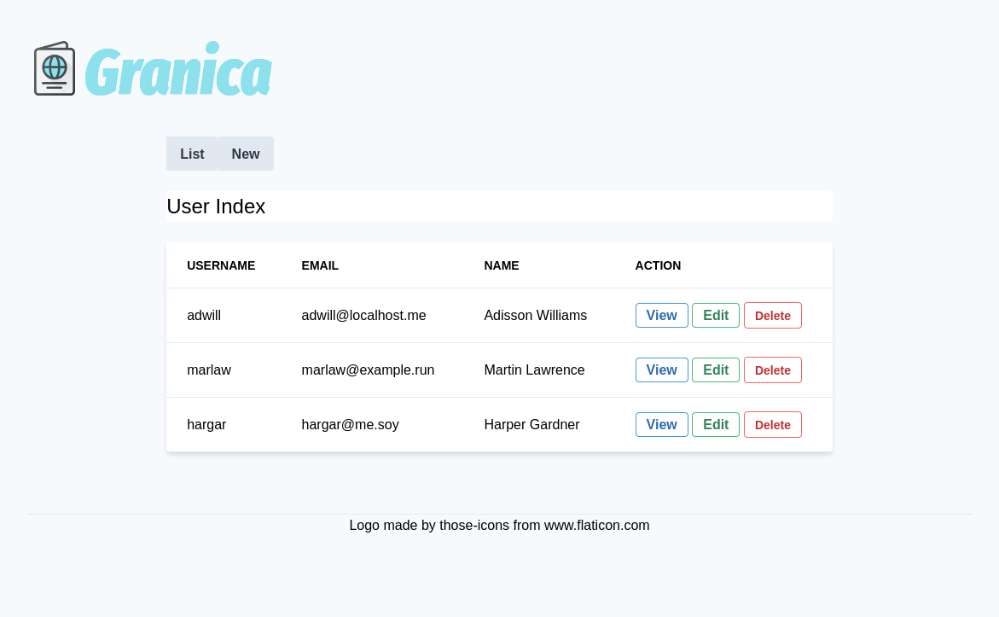

# Custom App

A base webapp based on [kabestan](https://gitlab.com/kabestan/backend/kabestan)

## Features

  * Config
  * Logging
  * Authentication
  * Authorization
  * Localization (I10n)
  * Web Endpoint
  * JSON REST Endpoint

## Routes [draft]

### Auth

| Method   | Path               | Handler      |
| -------- | ------------------ | ------------ |
| GET      | /auth/signup       | InitSignUp   |
| POST     | /auth/signup       | SignUp       |
| GET      | /auth/signin       | InitSignIn   |
| POST     | /auth/signin       | SignIn       |

### User

| Method   | Path                          | Handler      |
| -------- | ----------------------------- | ------------ |
| GET      | /users                        | Index        |
| GET      | /users/new                    | New          |
| POST     | /users                        | Create       |
| GET      | /users/{slug}                 | Show         |
| GET      | /users/{slug}/edit            | Edit         |
| PUT      | /users/{slug}                 | Update       |
| PATCH    | /users/{slug}                 | Update       |
| POST     | /users/{slug}/init-delete     | InitDelete   |
| DELETE   | /users/{slug}                 | Delete       |
| GET      | /users/{slug}/{token}/confirm | Confirm      |
