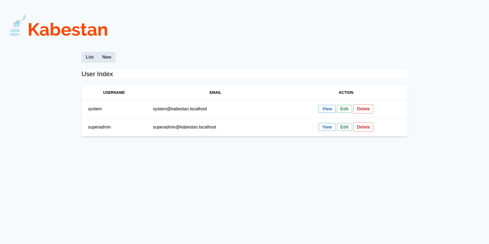

# Custom App

A base webapp based on [kabestan](https://gitlab.com/kabestan/backend/kabestan)



## Features

  * Config
  * Logging
  * Authentication
  * Authorization
  * Localization (I10n)
  * Web Endpoint
  * JSON REST Endpoint

## Routes [draft]

### Auth

| Method   | Path               | Handler      |
| -------- | ------------------ | ------------ |
| GET      | /auth/signup       | InitSignUp   |
| POST     | /auth/signup       | SignUp       |
| GET      | /auth/signin       | InitSignIn   |
| POST     | /auth/signin       | SignIn       |
| GET      | /auth/signout      | SignOut      |

### User

| Method   | Path                          | Handler      |
| -------- | ----------------------------- | ------------ |
| GET      | /users                        | Index        |
| GET      | /users/new                    | New          |
| POST     | /users                        | Create       |
| GET      | /users/{slug}                 | Show         |
| GET      | /users/{slug}/edit            | Edit         |
| PUT      | /users/{slug}                 | Update       |
| PATCH    | /users/{slug}                 | Update       |
| POST     | /users/{slug}/init-delete     | InitDelete   |
| DELETE   | /users/{slug}                 | Delete       |
| GET      | /users/{slug}/{token}/confirm | Confirm      |


## Dev. Env. Setup [draft]

After stabilizing this base app a (still not published) generator will be updated to automate most of this steps.

### Clone app

```shell
$ git clone https://gitlab.com/kabestan/repo/baseapp appname
```

Replace appname by the name of your app.

## Create user

If it does not exist yet.

```shell
$ psql
psql (11.5 (Ubuntu 11.5-1))
Type "help" for help.

user=# CREATE ROLE rolename;
user=# ALTER USER rolename WITH PASSWORD 'password';
```

Replace rolename by the database user owner.
Replace password by prefered password.

**Note**: First migration step includes POSTGis extension installation.
To do so, the superuser permission is required.
You can use something like this instead to create a role with SUPERUSER power.

```shell
user=# CREATE ROLE rolename SUPERUSER;
user=# ALTER USER rolename WITH PASSWORD 'password';
```

But as documentation sugests

```text
A database superuser bypasses all permission checks. This is a dangerous privilege and should not be used carelessly; it is best to do most of your work as a role that is not a superuser. To create a new database superuser, use CREATE ROLE name SUPERUSER. You must do this as a role that is already a superuser.
```

So this path is not recommended, at least in production environment.

Options:
* Remove permission after running migrations.
* Install POSTGis manually using another allowed user and comment
    * Comment **POSTGis** migrations steps in `internal/mig/mig.go`.

```go
// GetMigrator configured.
func (m *Migrator) addSteps() {
	// Migrations
	// Enable Postgis
	s := &step{}
	s.Config(s.EnablePostgis, s.DropPostgis) // <- comment this line
	m.AddMigration(s) // <- comment this line
```

### Create database

```shell
user=# CREATE DATABASE dbname OWNER rolename;
user=# CREATE DATABASE dbname_test OWNER rolename;
```

Replace dbname by the name of your app database.

### Update run.sh script

Edit `scripts/run.sh`

Replace `baseapp` by chosen app name

```shell
(...)
# Free ports
killall -9 baseapp
(...)
go build -o ./bin/baseapp ./cmd/baseapp.go
./bin/baseapp
```

Config system uses envar prefixes to set app configuration values.
By default this value is `KBS` but you can replace it with any other.

```shell
# Service
export KBS_SVC_NAME="kabestan"
export KBS_SVC_REVISION=$REV
export KBS_(...)
```

Edit other values according to the preferred ones and / or those of your system.

### Edit main

First rename `cmd/baseapp.go` to `cmd/appname.go` where appname is the name you have chosen for your application.

Edit `cmd/appname`

If you change this envvar prefix from "KBS" to, let say, "APP"

```go
  (...)
	cfg := kbs.LoadConfig("kbs") // <- change this
	// cfg := kbs.LoadConfig("app") // <- to something like this
  (...)
```

You can also change, but this value is not used for configuration purposes.

```go
const (
	// Replace by prefered
	appName = "kbs"
)
```

**Work in progress:** This draft needs to be augmented and, eventually, corrected.
